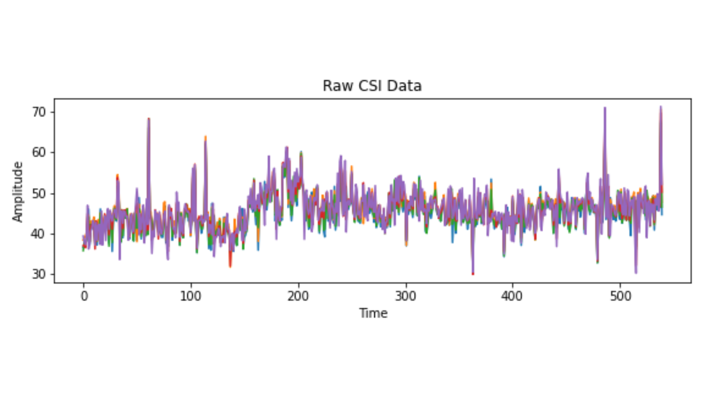
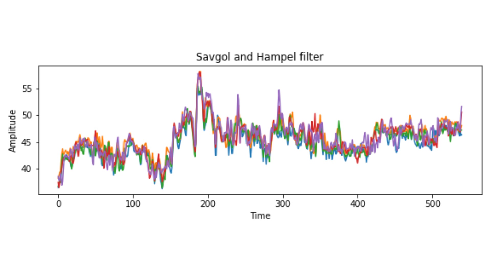
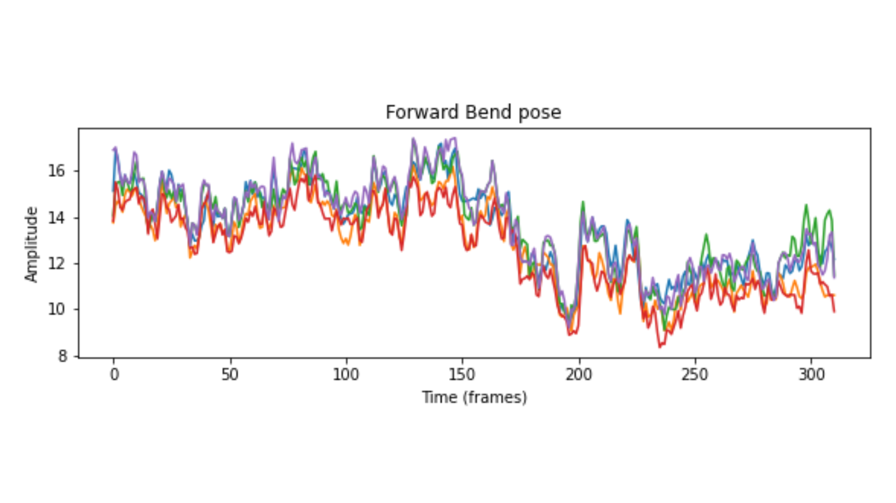
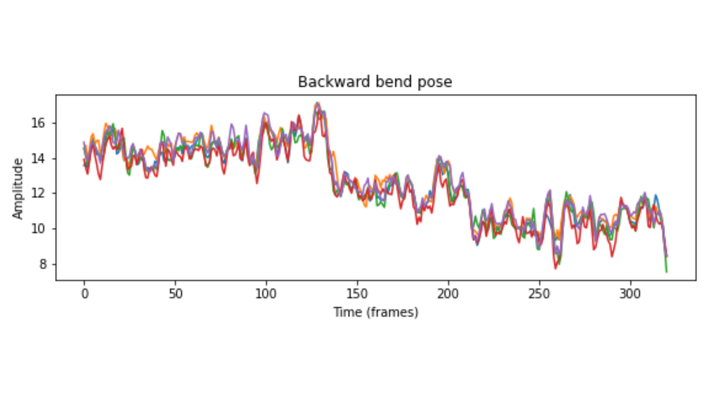
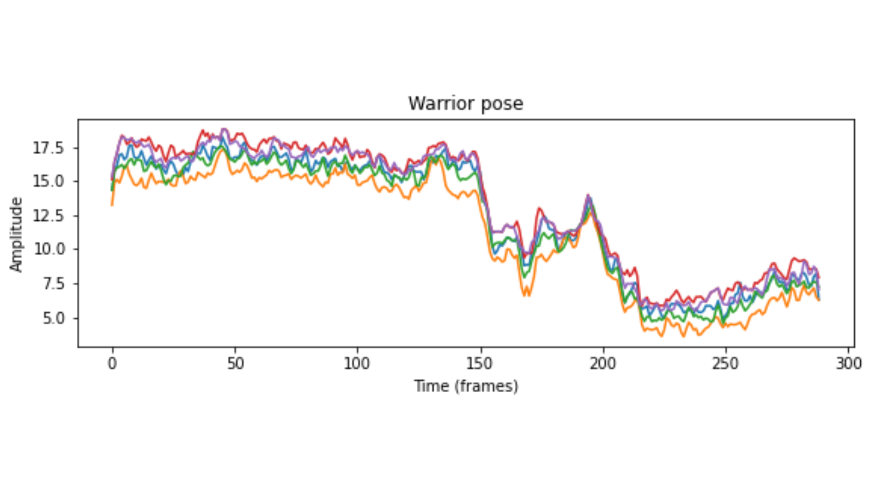
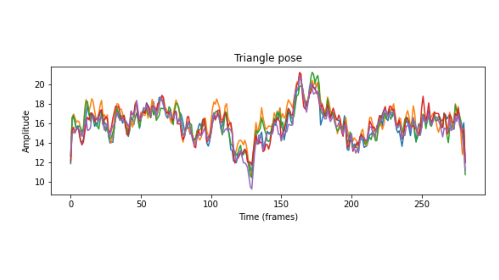
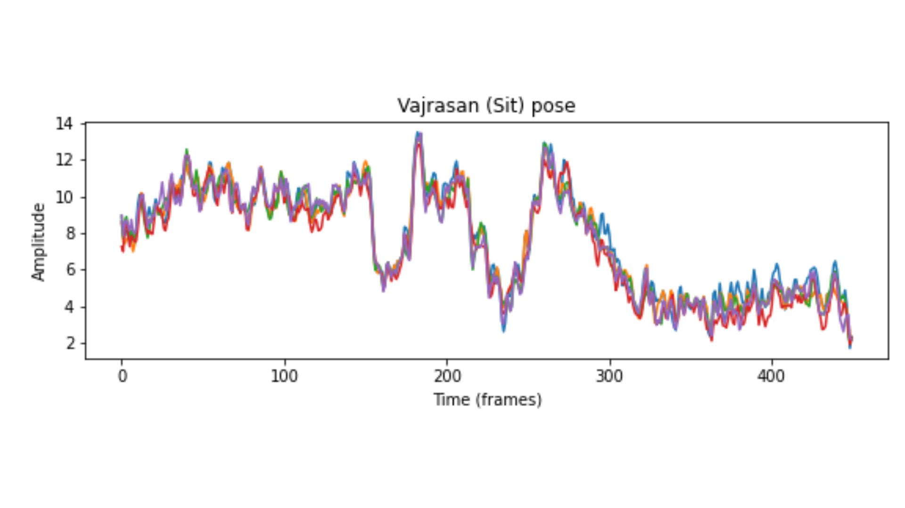

# Yoga Pose Recognition using WiFi Sensing

Traditional methods of recognizing human poses, such as cameras and wearable sensors, often raise concerns around privacy, cost, and comfort, particularly in sensitive environments like personal fitness. Yoga poses recognition, gaining popularity as people turn to digital fitness solutions, faces these limitations as users may be reluctant to use cameras for continuous monitoring during practice. Additionally, wearable devices can interfere with movements and require frequent maintenance.

## Objective

This project explores the feasibility of using WiFi sensing to recognize yoga poses without relying on visual or wearable input. By analyzing how WiFi signals interact with the human body and change as users move into various yoga poses, this approach aims to provide a non-intrusive, privacy-preserving, and cost-effective solution for yoga pose recognition. The outcomes of this project could extend to broader applications, including healthcare monitoring, elder care, and smart home fitness solutions, where privacy and convenience are key. We aim to build a machine-learning model that can classify different yoga poses based on WiFi CSI values.

## Methodology

 **Channel State Information (CSI)** refers to detailed data that describes how a wireless signal propagates between a transmitter and receiver. CSI provides a snapshot of the state of a communication channel, capturing how signals are influenced by obstacles, reflections, and other environmental factors as they travel. It contains complex values, often represented as amplitude and phase information, for each subcarrier frequency in a wireless channel.

In WiFi, CSI is particularly valuable as it provides granular insights into how each subcarrier of a signal is affected by the environment, making it possible to understand and analyze fine-grained variations in the wireless signal. This sensitivity makes CSI useful for applications beyond traditional communication, such as:

- **Indoor Positioning and Localization:** By analyzing CSI changes, devices can estimate distances and locate users or objects within a space.
- **Human Activity Recognition:** CSI data reveals movement and body positioning, allowing systems to detect activities like walking, sitting, or specific poses.
- **Health Monitoring:** Subtle shifts in CSI can be used to monitor breathing or other physiological signs without physical contact.

For these reasons, CSI has become a foundational element in non-intrusive sensing applications, providing a privacy-friendly alternative to cameras and wearable sensors in various contexts. The CSI data is collected using specific toolkits designed to extract WiFi CSI. A few of them are Intel 5300, ESP32, Atheros Nexmon, etc.

## Data Collection

We have conducted the experiments using a pair of ESP32 as both transmitter and receiver, placed at a distance of 10 feet, with the subject performing the yoga pose in between them. Four subjects aged 20-30 have performed five different yoga poses, each 100 times holding the pose for 5 seconds. The subjects per-
formed seven different yoga poses: Pose A: Uttanasana(Forward bend), Pose B: Virabhadrasana(Warrior pose right and left side), Pose C: Trikonasana(Triangle pose right and left side), Pose D: Vajrasana(Sit), and Pose E: Tadasana(Backward Bend). A total data of 400 samples for each pose is recorded. The data is collected using the ESPRESSIF CSI toolkit in the form of .csv files. The tool can capture up to 64 subcarrier data, which correspond to 64 amplitude and phase values. The CSV file contains RSSI, Timestamp, Mac Address, Length, CSI, etc values as columns and packets (corresponding to time) as rows. Here, we focus more on CSI values.

## Data Preprocessing

From the .csv file, we get the CSI column which has 128 values, these are 64 pairs of real and imaginary values that correspond to 64 pairs of amplitude and phase values. They are extracted using the below formula,
- Amplitude formula: `|H| = sqrt(real^2 + imaginary^2)`
- Phase formula: `theta = arctan(imaginary/real)`

After extracting the amplitude and phase values, we need to preprocess the data, to remove outliers and noise added to it. In signal processing, we use filters such as Hampel, Bandpass, Kalman, Savitzky-Golay, etc for filtering out the noise and outlier removal. A combination of SG and Hampel filters is used for preprocessing the signal data.

  
  

## Data Visualization

Once the signal is processed, we plot the amplitude vs. time graph for each pose, using Matplotlib. We observed that each pose has a unique noticeable pattern.

  
  

  
  

  

## Feature Extraction
From the preprocessed Channel State Information(CSI) data, a variety of statistical features were extracted to capture the characteristics of the various yoga poses. These features included minimum, maximum, mean, variance, skewness, kurtosis, IQR range, etc.
 
## Machine Learning Implementation
The visual analysis confirmed that certain features exhibited distinct patterns for each pose, facilitating the feature selection process for machine learning (ML) models. For the classification of yoga poses, several machine-learning algorithms were evaluated, including K Nearest Neighbour(KNN), Random Forest, Gradient Boosting, Xtreme Gradient Boosting, Decision trees, AdaBoosting, and Logistic Regression. After preliminary evaluations, the Random Forest model demonstrated superior performance in terms of accuracy and robustness. The hyperparameters were selected based on low bias and low variance, ensuring the model is generalized to new data.

## Conclusion
Considering the accuracy and F1 score metrics, the best performance model Random Forest showed an accuracy of 92% with an F1 score of 0.90. Using a two-stage machine learning model, we can even classify the pose and direction.

